# FILMIZYAN

[](https://nodejs.org/en)
[](https://fastapi.tiangolo.com/)
[](https://www.sqlalchemy.org/)
[](https://docs.pydantic.dev/latest/)
[](https://kinopoiskapiunofficial.tech/)
[](https://developers.google.com/identity/protocols/oauth2)
[](https://argon2-cffi.readthedocs.io/en/stable/)
[](https://www.docker.com/)
[](https://en.wikipedia.org/wiki/Redis)
[](https://en.wikipedia.org/wiki/REST)
[](https://en.wikipedia.org/wiki/HTTP)
[](https://docs.python.org/3/library/logging.html)


<p align="center">
  
  <br>
  <b>Example of work</b>
</p>

<hr>

<p align="center">
  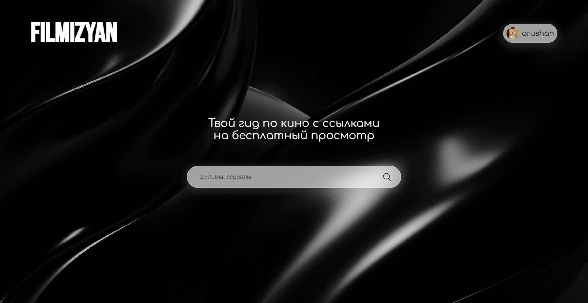
  <br>
  <b>Main page</b>
</p>

<hr>

<p align="center">
  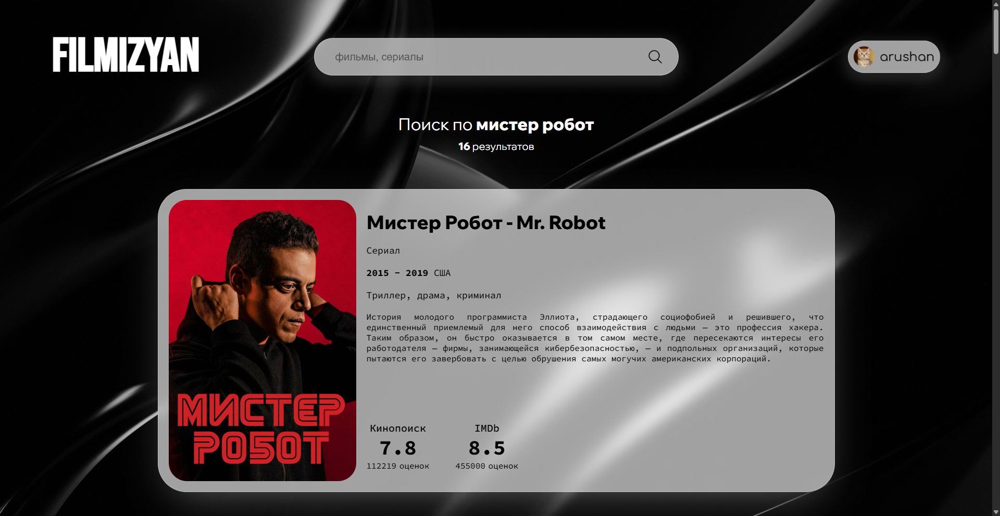
  <br>
  <b>Search page</b>
</p>

<hr>

<p align="center">
  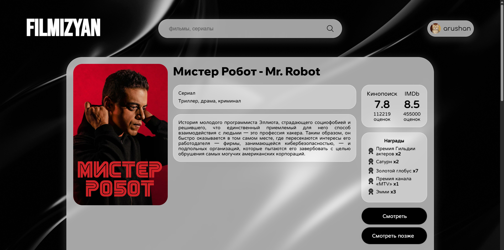
  <br>
  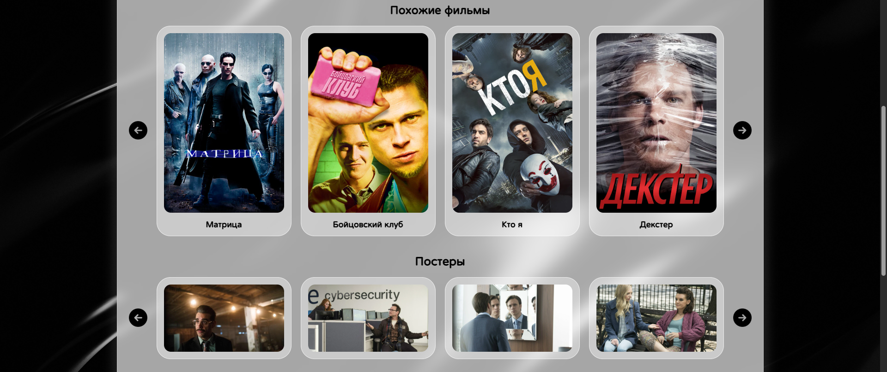
  <br>
  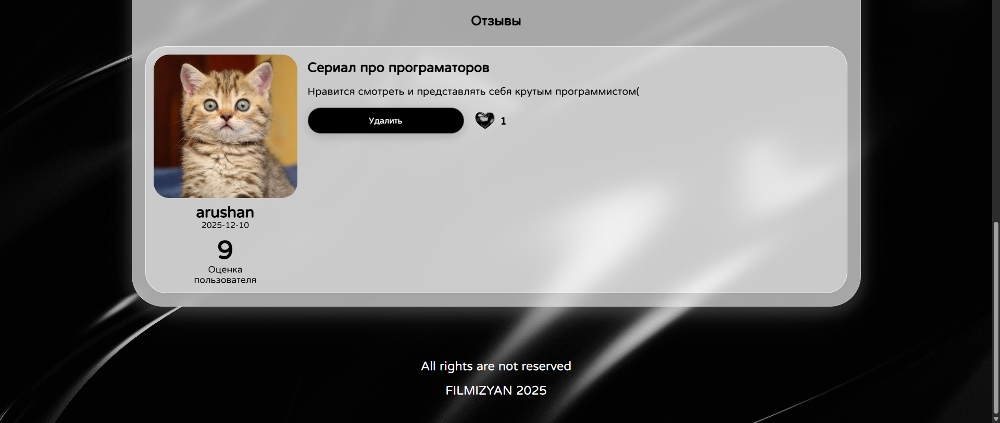
  <br>
  <b>Film page</b>
</p>

<hr>

<p align="center">
  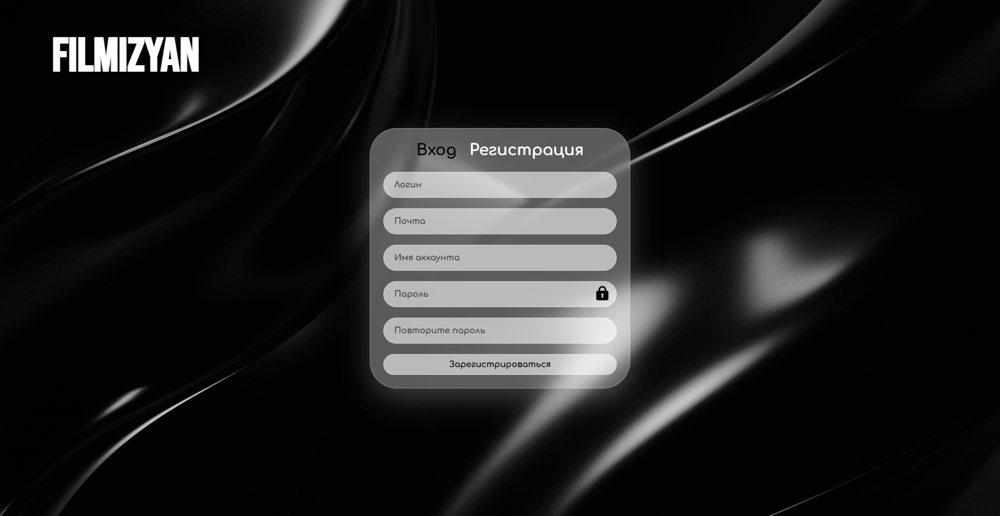
  <br>
  <b>Authorization page</b>
</p>

<hr>
<p align="center">
  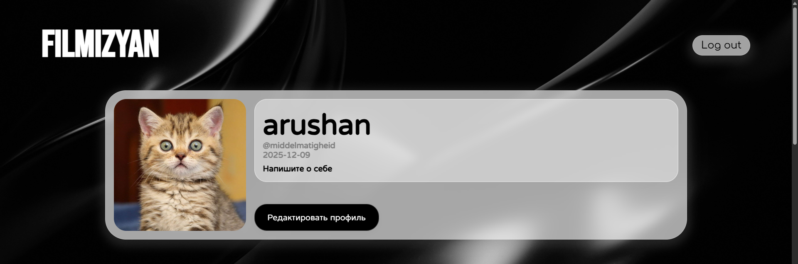
  <br>
  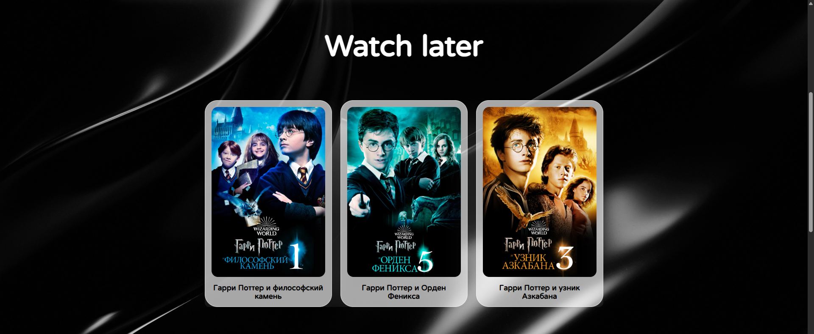
  <br>
  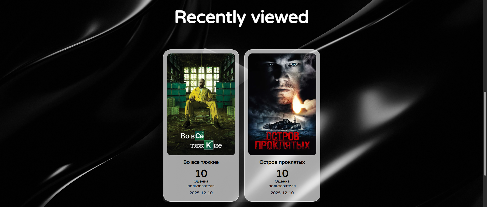
  <br>
  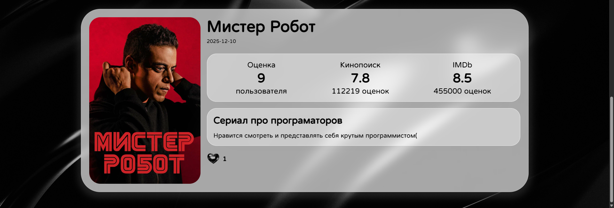
  <br>
  <b>Profile page</b>
</p>

<hr>

<p align="center">
  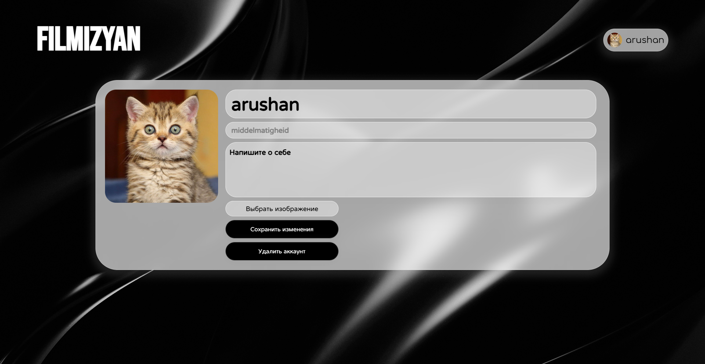
  <br>
  <b>Edit profile page</b>
</p>


# Disclaimer 
This project is intended for educational purposes only. The project administration is not responsible for the content of external resources (such as Flicksbar) and encourages users to respect copyrights and use only legal sources to view content


# About the project

Project idea, HTML & CSS, work with Kinopoisk API Unofficial, email sender, password hasher and more are made by [**zkqw3r**](https://github.com/zkqw3r)

**Filmizyan** is an analog of [Kinopoisk](https://www.kinopoisk.ru/). **Filmizyan** is a website with unique, beautiful and convenient design, that provides links for pirate versions of films via [flicksbar](https://flcksbr.top/). By using a searcher for searching films by title you will be suggested with multiple films choices, for which you can see theirs short information. You can also see film's full information with its trailers, similar movies, sequels and posters by visiting a certain film page. There is an account system, where users can register, login, logout, edit a profile and recover an account. To complete the registration or recovery you have to follow a link, that is being sent on your email. Authorized users can then add films to their watch later lists, leave reviews on a film and like reviews

Initially **Filmizyan** was wade on Flask, but short time after we have decided to try something new, so it was redone as it is now

The frontend made on node.js, express wasn't used because we wanted to clearly understand how does vanilla node.js work to have some basic knowledge. The backend made on python FastAPI with PostgreSQL database. The frontend runs on 8000 port and sends requests to the backend running on 5000 port. User authentification is done with JWT, that was being saved in user's cookie. There is also a docker containerization and redis caching. It was the first time for both of us using this technologies, so the project is far away from being called perfect

When user searches film by title, main film information is being searched in the database, if there is no info there it's being added from Kinopoisk Unofficial API. The same when user opens a certain film page, its additional info is being added to the database from Kinopoisk Unofficial API, if it's not there yet. Therefore, at first, website works a bit slow, untill a decent amount of data is being stored in the database, then the website stops sending frequent requests to the Kinopoisk API Unofficial and takes the data from the database. There is a loading page while waiting for a response from the backend


# Main functions

- Searching films by title
- Viewing films full information
- Viewing films trailers, similar movies, sequels, posters
- Creating and editing profiles
- Adding films to a watch later list
- Leaving reviews and liking them

# Used in project

- [Node.js](https://nodejs.org/en) - frontend
- [Python](https://www.python.org/) 3.11.9 - be careful, because newer versions can have some issues with the asyncpg module
- [FastAPI](https://fastapi.tiangolo.com/) - backend
- [SQLAlchemy](https://www.sqlalchemy.org/) - work with [PostgreSQL](https://www.postgresql.org/) database
- [Pydantic](https://docs.pydantic.dev/latest/) - form validations
- [Logging](https://docs.python.org/3/library/logging.html) - logs
- [Google_auth_oauthlib](https://pypi.org/project/google-auth-oauthlib/) - email sender
- [Argon2](https://pypi.org/project/argon2-cffi/) - password hasher
- [Kinopoisk API Unofficial](https://kinopoiskapiunofficial.tech/) - getting films info
- [Docker](https://www.docker.com/) - containerization
- [Redis](https://en.wikipedia.org/wiki/Redis) - caching
- Nunjucks and Jinja2 - rendering the templates
- HTML, CSS, JavaScript

# Downloading and running the website

### 1. Download [Python](https://www.python.org/), [Node.js](https://nodejs.org/en) and IDE

You can use any IDE you want, VSCode for example

### 2. Download ZIP or use git clone

```bash
git clone https://github.com/middelmatigheid/filmizyan.git
cd filmizyan
```

### 3. Install node.js modules

```bash
npm install
```

### 4. Create python virtual environment

If you are using Windows

```bash
python -m venv backend/venv
backend/venv/Scripts/activate 
```

If you are using Linux/MacOS

```bash
python -m venv backend/venv
source backend/venv/bin/activate
```

### 5. Install python requirements

```bash
pip install -r backend/requirements.txt
```

### 6. Install [PostgreSQL](https://www.postgresql.org/) and pgAdmin4

Set up your database

### 7. Install and set up Redis

If you are using Windows

Run PowerShell as administrator and write commands

```bash
wsl --install -d Ubuntu
wsl -d Ubuntu
sudo apt-get install redis
redis-server
```

If you are using Linux/MacOS

```bash
sudo apt-get install redis
redis-server
```

If you are using MacOS

Make sure to have Homebrew installed first

```bash
brew install redis
redis-server
```

### 8. Set up the email sender

- Go to [Google console](https://console.cloud.google.com/)
- Create your own project
- Go to API & Services -> Credentials 
- Create credentials -> OAuth client ID (application type -> desktop app)
- Save credentials.json to project directory

When you first launch it, a window will open where you will need to log into your Google account, after authorization, __token.pickle__ will be created in the project directory

### 9. Create Kinopoisk Unofficial API key

Go to [Kinopoisk API Unofficial](https://kinopoiskapiunofficial.tech/) and create your API key

### 10. Create .env file

Create .env file in the main directory and set up the values

```bash
REDIS_HOST = localhost
REDIS_PORT = YOUR REDIS PORT # 6379 by default

DB_HOST = localhost
DB_NAME = YOUR DB NAME
DB_USER = YOUR DB USERNAME
DB_PASSWORD = YOUR DB USER PASSWORD
DB_PORT = YOUR DB PORT # 5432 by default

CREDS_FILE = credentials.json
TOKEN_FILE = token.pickle
EMAIL = YOUR EMAIL # (email address from which letters will be sent to users on behalf of the website)
KINOPOISK_UNOFFICIAL_API_KEY = YOUR KINOPOISK UNOFFICIAL API KEY
JWT_ACCESS_TOKEN_SECRET = YOUR JWT ACCESS TOKEN SECRET
```

You can additionally specify
```bash
ARGON2_TIME_COST = YOUR ARGON2 TIME COST # The number you deem necessary (Default settings can be used)
ARGON2_MEMORY_COST = YOUR ARGON2 MEMORY COST # The number you deem necessary (Default settings can be used)
ARGON2_PARALLELISM = YOUR ARGON2 PARALLELISM # The number you deem necessary (Default settings can be used)
ARGON2_HASH_LEN = YOUR ARGON2 HASH LEN # The number you deem necessary (Default settings can be used)
ARGON2_SALT_LEN = YOUR ARGON2 SALT LEN # The number you deem necessary (Default settings can be used)
```

### 11. Run the website


If you are using Windows

```bash
taskkill /f /im python.exe; npm start
```

If you are using Linux/MacOS

```bash
pkill -f python & npm start
```

### 12. Reload the database

Visit http://localhost:5000/reload-database to reload the database

### 13. The website is ready

Website would be available at http://127.0.0.1:8000 or http://localhost:8000

# Docker version

Make sure to have **credentials.json** and **token.pickle** in the backend folder first, you can create them by following the steps above

### 1. Download [Docker](https://www.docker.com/)

Download Docker and run Docker Desktop

### 2. Edit url

Edit API_URL in frontend.js file
Edit logging file path in frontend.js, backend.py, database.py, kinopoisk_api.py, email_sender.py, just uncomment the right one and comment previous

### 3. Edit .env file

Edit host in .env file

```bash
REDIS_HOST = redis
DB_HOST = db
```

### 4. Build up the images

```bash
docker compose down -v
docker system prune -a -f
docker compose build --no-cache
docker compose up
```

### 5. Reload the database

Visit http://localhost:5000/reload-database to reload the database

### 6. The website is ready

Website would be available at http://127.0.0.1:8000 or http://localhost:8000

# Project structure

Total project structure should look like this

```bash
filmizyan/
├── frontend/                   # Frontend folder
│   ├── frontend.js             # File for operating the Node.js frontend
│   ├── package.json            # Npm initialization for Docker version
│   ├── package-lock.json
│   ├── Dockerfile              # Docker for the frontend
│   ├── static/                 # Static files folder
│   │   ├── css/                # CSS files folder
│   │   ├── js/                 # Javascript files folder
│   │   ├── images/             # Images folder
│   │   │   ├── basic/          # Basic images folder
│   │   │   └── users/          # Users images folder
│   │   └── videos/             # Videos folder
│   └── templates/              # Nunjucks templates
├── backend/                    # Backend folder
│   ├── backend.py              # File for operating the FastAPI backends
│   ├── Dockerfile              # Docker for the backend
│   ├── app/                    # Python folder
│   │   ├── database.py         # File for operating the database
│   │   ├── api.py              # File for operating the Kinopoisk Unofficial API
│   │   ├── password.py         # File for operating the passwords
│   │   └── email_sender.py     # File for operating the email sender
│   ├── credentials.json        # Google OAuth credential
│   ├── token.pickle
│   └── requirements.txt        # Python requirements    
├── package.json                # Npm initialization for main version
├── package-lock.json
├── docker-compose.yml         
└── .env
```

## Authors

<table>
  <tr>
    <td align="center">
      <a href="https://github.com/middelmatigheid">
        
        <br />
        <sub><b>middelmatigheid</b></sub>
      </a>
    </td>
    <td align="center">
      <a href="https://github.com/zkqw3r">
        
        <br />
        <sub><b>zkqw3r</b></sub>
      </a>
    </td>
  </tr>
</table>